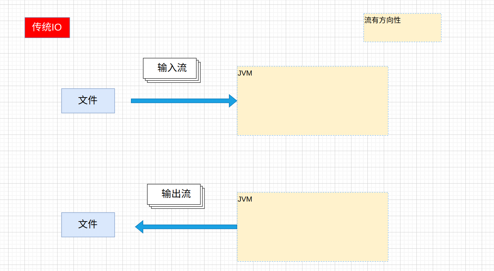
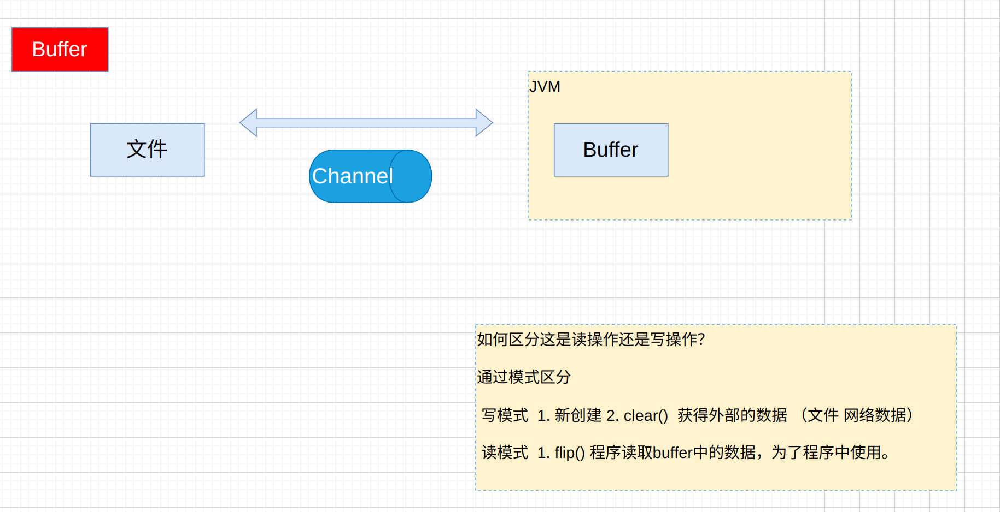
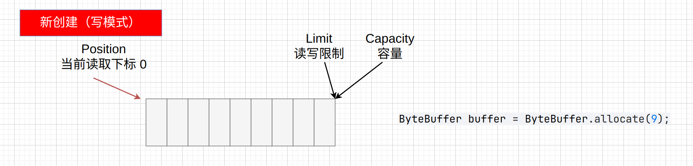

# Netty
## 1.NIO编程
### 1.1 Channel
在Java NIO中，`Channel` 和 `Buffer` 是两个核心概念，它们为高效的I/O操作提供了基础。下面详细介绍它们的定义、常见类型以及如何获取它们。

### 一、Channel（通道）

#### 1. 什么是Channel？
`Channel`（通道）是Java NIO中用来代表 I/O 操作的数据传输对象。
它类似于传统的 `InputStream` 和 `OutputStream`，但不同的是 `Channel` 是双向的，既可以用于读取数据，也可以用于写入数据（有些通道是单向的）。
`Channel` 是一种更低级的接口，可以直接与操作系统交互，并且它通常与 `Buffer` 结合使用，支持非阻塞I/O操作和异步I/O操作，极大提高了效率。


#### 2. 常见的Channel类型
Java NIO 中提供了几种常见的 `Channel` 实现，分别用于处理文件、网络、管道等不同的数据传输场景：

- **FileChannel**：用于文件数据的读取、写入、映射等操作。
- **SocketChannel**：用于网络Socket的读写操作，类似于传统的 `Socket`，但是支持非阻塞模式。
- **ServerSocketChannel**：用于监听 TCP 连接，像 `ServerSocket` 一样工作，支持非阻塞模式。
- **DatagramChannel**：用于UDP数据的传输。
- **Pipe.SinkChannel 和 Pipe.SourceChannel**：`Pipe` 用于在两个线程之间的单向通信，`SinkChannel` 用于写入数据，`SourceChannel` 用于读取数据。


#### 3. Channel 的获取方式
`Channel` 通常是通过以下几种方式获取的：
- 通过文件 I/O 流获取 `FileChannel`：
  ```java
  FileChannel fileChannel = new FileInputStream("file.txt").getChannel();
  ```

- 通过网络套接字获取 `SocketChannel` 和 `ServerSocketChannel`：
  ```java
  SocketChannel socketChannel = SocketChannel.open(new InetSocketAddress("localhost", 8080));
  ServerSocketChannel serverSocketChannel = ServerSocketChannel.open();
  ```

- 通过 `Pipe` 获取进程间的通信通道：
  ```java
  Pipe pipe = Pipe.open();
  Pipe.SinkChannel sinkChannel = pipe.sink();
  Pipe.SourceChannel sourceChannel = pipe.source();
  ```

---

### 二、Buffer（缓冲区）

#### 1. 什么是Buffer？
`Buffer` 是一个用于临时存储数据的容器。在Java NIO中，所有对 `Channel` 的数据读写操作都是通过 `Buffer` 进行的。
`Buffer` 不是直接用于数据的传输，而是用来存储从 `Channel` 中读取的数据，或准备写入到 `Channel` 的数据。

`Buffer` 通过管理其内部的指针来跟踪存储的数据位置。通常，`Buffer` 在写入模式时接收数据，在读模式时提取数据。

#### 2. 常见的Buffer类型
Java NIO 提供了多种类型的缓冲区，每种类型都用于存储不同类型的数据：

- **ByteBuffer**：存储字节数据，是最常用的缓冲区类型。
    - 例子：
      ```java
      ByteBuffer buffer = ByteBuffer.allocate(1024); // 分配一个容量为 1024 字节的缓冲区
      ```
- **CharBuffer**：存储字符数据，通常用于处理字符集编码的情况。
- **IntBuffer**：存储整数（int）数据。
- **FloatBuffer**：存储浮点数（float）数据。
- **DoubleBuffer**：存储双精度浮点数（double）数据。
- **LongBuffer**：存储长整型（long）数据。
- **ShortBuffer**：存储短整型（short）数据。

#### 3. Buffer的核心属性与方法
- **Capacity（容量）**：`Buffer`的容量是固定的，表示缓冲区能容纳的数据量（如字节、字符、整数等）。
- **Position（位置）**：下一个可以被读或写的索引位置。
- **Limit（限制）**：在读模式下，`Limit`表示有多少数据可供读取；在写模式下，`Limit`表示你最多能写多少数据。
- **Flip()**：将缓冲区从写模式切换到读模式，准备从缓冲区中读取数据。
- **Clear()**：将缓冲区清空，重新进入写模式。
- **Rewind()**：重置位置`Position`，允许重新读取缓冲区中已有的数据。
- buffer中写入数据[写模式  创建一个bytebuffer ,clear(),compact()]
```text
  1. channel的read方法
     channel.read(buffer)
  2. buffer的put方法
     buffer.put(byte)    buffer.put((byte)'a')..
     buffer.put(byte[])
```
- 从buffer中读出数据
```text
1. channel的write方法
  
  2. buffer的get方法 //每调用一次get方法会影响，position的位置。
  
  3. rewind方法(手风琴)，可以将postion重置成0 ，用于复读数据。
  
  4. mark&reset方法，通过mark方法进行标记（position），通过reset方法跳回标记，从新执行.
  
  5. get(i) 方法，获取特定position上的数据，但是不会对position的位置产生影响。
```




写入Buffer数据之前要设置写模式
1. 写模式
    1. 新创建的Buffer自动是写模式
    2. 调用了clear,compact方法

读取Buffer数据之前要设置读模式
2. 读模式
    1. 调用flip方法

#### 2.4 字符串&Buffer
**字符串存储到Buffer中**
```text
ByteBuffer buffer = ByteBuffer.allocate(10);
buffer.put("sunshuai".getBytes());

buffer.flip();
while (buffer.hasRemaining()) {
  System.out.println("buffer.get() = " + (char)buffer.get());
}
buffer.clear();


ByteBuffer buffer = Charset.forName("UTF-8").encode("Hello");

1、encode方法自动 把字符串按照字符集编码后，存储在ByteBuffer.
2、自动把ByteBuffer设置成读模式，且不能手工调用flip方法。

ByteBuffer buffer = StandardCharsets.UTF_8.encode("Hello");

while (buffer.hasRemaining()) {
  System.out.println("buffer.get() = " + (char) buffer.get());
}
buffer.clear();
1、encode方法自动 把字符串按照字符集编码后，存储在ByteBuffer.
2、自动把ByteBuffer设置成读模式，且不能手工调用flip方法。
  
ByteBuffer buffer = ByteBuffer.wrap("Hello".getBytes());
while (buffer.hasRemaining()) {
  System.out.println("buffer.get() = " + (char) buffer.get());
}
buffer.clear();
```
**Buffer中的数据转换成字符串**
```java
ByteBuffer buffer = ByteBuffer.allocate(10);
buffer.put("韩".getBytes());

buffer.flip();
CharBuffer result = StandardCharsets.UTF_8.decode(buffer);
System.out.println("result.toString() = " + result.toString());
```
---
### 三.NIO程序开发
#### 3.1 第一个NIO程序分析
```java
public class TestNIO1 {
    public static void main(String[] args) throws IOException {
        //1 创建Channel通道  FileChannel
        FileChannel channel = new FileInputStream("data1.txt").getChannel();

        //2 创建缓冲区
        //1234567890
        ByteBuffer buffer = ByteBuffer.allocate(10);

        while (true) {
            //3把通道内获取的文件数据，写入缓冲区
            int read = channel.read(buffer);

            if (read == -1) break;

            //4.程序读取buffer内容，后续的操作。设置buffer为读模式。
            buffer.flip();

            //5.循环读取缓冲区中的数据
            while (buffer.hasRemaining()) {
                byte b = buffer.get();
                System.out.println("(char)b = " + (char) b);
            }

            //6. 设置buffer的写模式
            buffer.clear();
        }
    }
}

public class TestNIO2 {
    public static void main(String[] args) {
        FileChannel channel = null;
        try {
            channel = new RandomAccessFile("data1.txt", "rw").getChannel();
            ByteBuffer buffer = ByteBuffer.allocate(15);
            while (true) {
                int read = channel.read(buffer);
                if (read == -1) {
                    break;
                }
                buffer.flip();
                while (buffer.hasRemaining()) {
                    byte b = buffer.get();
                    log.info("(char)b = {}", b);
                }
                buffer.clear();
            }
        } catch (Exception e) {
            e.printStackTrace();
        } finally {
            if (channel != null) {
                try {
                    channel.close();
                } catch (IOException e) {
                    throw new RuntimeException(e);
                }
            }
        }
    }
}

public class TestNIO3 {
    public static void main(String[] args) {

        try (FileChannel channel = FileChannel.open(Paths.get("data1.txt"), StandardOpenOption.READ)) {

            ByteBuffer buffer = ByteBuffer.allocate(10);
            while (true) {
                int read = channel.read(buffer);
                if (read == -1) break;

                buffer.flip();
                while (buffer.hasRemaining()) {
                    byte b = buffer.get();
                    System.out.println("(char)b = " + (char) b);
                }

                buffer.clear();
            }

        } catch (Exception e) {
            e.printStackTrace();
        }
    }
}
```

#### 3.2 NIO开发的步骤总结
```text
1. 获取Channel 
2. 创建Buffer
3. 循环的从Channel中获取数据，读入到Buffer中。进行操作.
    channel.read(buffer);

    buffer.flip();//设置读模式
    循环从buffer中获取数据。
    buffer.get();
    buffer.clear();//设置写模式
```

